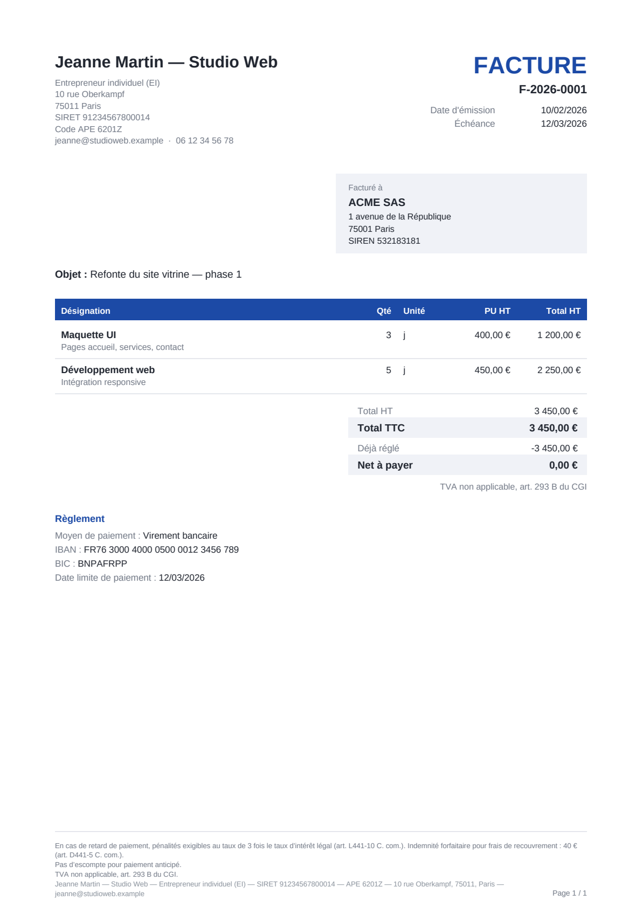

<!--
  Oumno-Utile — collection d'utilitaires auto-hébergés, chacun sans aucune
  dépendance externe (uniquement la bibliothèque standard de Node.js).

  Outils du dépôt :
    • Facturier (ce dossier)  — facturation Factur-X / EN 16931. Voir ci-dessous.
    • Créneau  (creneau/)     — prise de rendez-vous en ligne (iCalendar RFC 5545).
                                Voir creneau/README.md.
-->

# Facturier

> Premier des utilitaires d'**Oumno-Utile**. Le second, **Créneau** (prise de
> rendez-vous en ligne, RFC 5545), se trouve dans [`creneau/`](creneau/README.md).
> Les deux partagent la même exigence : aucune dépendance externe.

Logiciel de **facturation pour indépendants et micro-entreprises**, auto-hébergé,
sans aucune dépendance externe. Devis, factures et avoirs générés en **PDF/A-3
avec Factur-X** (XML EN 16931 embarqué) — le format structuré de la facturation
électronique française.

Le tout tient dans du Node.js « nu » : le moteur PDF, le parseur de polices
TrueType, le profil colorimétrique ICC, le XML Factur-X, le serveur HTTP et la
base de données sont écrits à la main. Pas de `node_modules`, pas de chaîne
d'approvisionnement à auditer, pas de mise à jour de sécurité tierce à suivre.



## Pourquoi

La réforme de la facturation électronique impose progressivement aux
entreprises françaises d'émettre et de recevoir des factures au format
**structuré** (Factur-X, UBL ou CII), et non plus de simples PDF. Les outils
existants sont soit des SaaS payants au mois, soit des usines à gaz. Un
indépendant veut une chose simple : saisir une prestation, sortir une facture
conforme, suivre ses encaissements et ses seuils. C'est exactement ce que fait
Facturier — et comme il tourne chez vous, vos données comptables ne quittent
jamais votre machine.

## Ce qu'il fait

- **Devis → facture → avoir** avec le cycle de vie complet (brouillon, émission,
  envoi, acceptation/refus, paiement, annulation par avoir).
- **Factur-X / EN 16931** : chaque facture et avoir émis est un PDF/A-3
  contenant le XML CII normalisé `factur-x.xml`, prêt pour les plateformes de
  dématérialisation.
- **Numérotation légale** séquentielle, sans trou, figée à l'émission ;
  documents émis **inaltérables** (toute correction passe par un avoir).
- **Gestion de la TVA** : franchise en base (art. 293 B du CGI) ou assujetti,
  multi-taux (20 / 10 / 5,5 / 2,1 %), calcul conforme EN 16931 (par taux, sur la
  somme des bases).
- **Clients** et **catalogue** de prestations réutilisables.
- **Suivi des règlements** (complets ou partiels) avec passage automatique au
  statut « payée ».
- **Tableau de bord** : CA facturé, encaissé, en attente, en retard, CA mensuel,
  et suivi des **seuils** de franchise de TVA et du plafond micro-entreprise.
- **Exports** : CSV comptable de tous les documents, sauvegarde de la base (.db).
- **Mentions légales** générées automatiquement (pénalités de retard, indemnité
  forfaitaire de recouvrement, mention d'exonération de TVA, etc.).

## Prise en main

Node.js **≥ 22.5** est requis (pour le module natif `node:sqlite`).

```bash
# Lancer avec des données de démonstration (mot de passe : demo1234)
npm run demo
# puis ouvrir http://127.0.0.1:3131

# Ou démarrer une instance vierge
npm start
# À la première connexion, vous choisissez votre mot de passe.

# Lancer la suite de tests
npm test
```

### Configuration

Variables d'environnement (toutes optionnelles) :

| Variable         | Défaut                  | Rôle                                  |
|------------------|-------------------------|---------------------------------------|
| `FACTURIER_DATA` | `./data/facturier.db`   | Chemin du fichier SQLite              |
| `PORT`           | `3131`                  | Port d'écoute                         |
| `HOST`           | `127.0.0.1`             | Interface d'écoute                    |

Par défaut, le serveur **n'écoute qu'en local**. Pour l'exposer, placez-le
derrière un reverse proxy TLS (Caddy, nginx…) et fixez `HOST=0.0.0.0`.

## Architecture

```
server.js              Point d'entrée : serveur HTTP, session, anti-CSRF, statique
src/
  db.js                Schéma SQLite + migrations, réglages, numérotation légale
  compute.js           Moteur monétaire (centimes entiers) et calcul de TVA EN 16931
  facturx.js           Générateur XML CII / EN 16931 (Factur-X)
  auth.js              scrypt, sessions hachées, anti force-brute
  router.js            Micro-routeur HTTP + fichiers statiques
  api.js               API REST (clients, catalogue, documents, paiements, stats)
  pdf/
    font.js            Parseur TrueType (cmap 4/12, hmtx, métriques) + WinAnsi
    icc.js             Profil ICC v2 sRGB généré (OutputIntent PDF/A)
    xmp.js             Métadonnées XMP PDF/A-3 + schéma d'extension Factur-X
    writer.js          Writer PDF from scratch (objets, xref, streams, pièces jointes)
    layout.js          Mise en page A4 des documents (tableau paginé, mentions)
public/                Interface web (SPA vanilla : index.html, app.js, style.css)
assets/fonts/          Polices Liberation Sans (licence OFL, embarquées dans le PDF)
test/                  Tests node:test (calcul, Factur-X, PDF, API bout-en-bout)
docs/CONFORMITE.md     Détail de la conformité normative et réglementaire
```

### Choix techniques notables

- **Montants en centimes** (entiers) de bout en bout : aucune erreur de virgule
  flottante ne peut se glisser dans une facture.
- **PDF écrit à la main** : polices TrueType intégralement embarquées, profil ICC
  sRGB généré programmatiquement, table xref exacte, `/ID` dans le trailer, XMP
  non compressé — l'ensemble vise la structure attendue par PDF/A-3B.
- **SQLite natif** (`node:sqlite`) en mode WAL, avec migrations versionnées.
- **Sécurité** : mot de passe scrypt, sessions opaques stockées hachées, cookie
  `HttpOnly` + `SameSite=Strict`, en-tête anti-CSRF exigé sur les mutations,
  limitation des tentatives de connexion.

## Conformité

Voir [`docs/CONFORMITE.md`](docs/CONFORMITE.md) pour le détail des normes visées
(EN 16931, Factur-X 1.0, PDF/A-3, mentions obligatoires du Code de commerce et du
CGI) et les **limites** à connaître avant une mise en production.

## Licence

Code sous licence **MIT**. Les polices Liberation Sans embarquées sont sous
**SIL Open Font License 1.1** (voir `assets/fonts/LICENSE-LIBERATION.txt`), qui
autorise leur redistribution et leur intégration dans les PDF produits.
