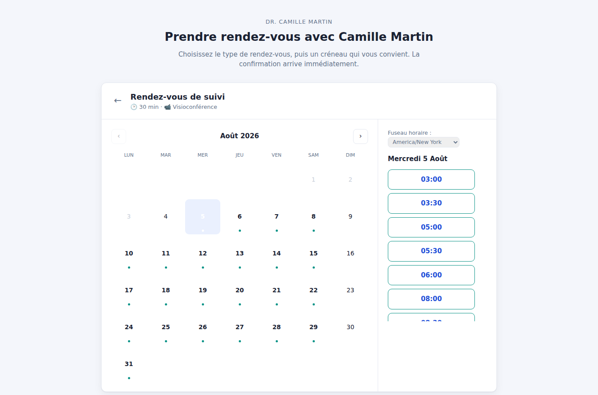

# Créneau

**Prise de rendez-vous en ligne**, auto-hébergée — une alternative à Calendly
que vous faites tourner chez vous. Vos invités choisissent un créneau sur une
page publique, dans **leur propre fuseau horaire** ; vous gérez vos
disponibilités depuis une console d'administration. Chaque réservation produit
un fichier **iCalendar (RFC 5545)** ajoutable à n'importe quel agenda.

Comme le reste de ce dépôt, Créneau est écrit **sans aucune dépendance** : tout
tient sur la bibliothèque standard de Node.js — serveur HTTP, base SQLite native,
moteur de disponibilités, conversions de fuseaux horaires et génération
iCalendar sont faits maison.



## Le problème résolu

Proposer ses disponibilités par e-mail est pénible et source d'erreurs, surtout
entre fuseaux horaires (« 15 h chez moi, c'est quelle heure chez vous ? »). Les
solutions SaaS règlent le problème mais hébergent vos rendez-vous, vos contacts
et souvent votre agenda sur leurs serveurs. Créneau fait le même travail — un
lien public, un calendrier de créseaux libres, une confirmation automatique —
en gardant **toutes les données chez vous**.

## Fonctionnalités

**Côté invité (page publique, sans compte)**
- Choix parmi plusieurs **types de rendez-vous** (durée, lieu, couleur).
- **Calendrier mensuel** indiquant les jours ayant des disponibilités.
- Créneaux affichés dans le **fuseau horaire de l'invité** (détecté, modifiable).
- Réservation en un clic, **confirmation immédiate** avec fichier `.ics`.
- Page de gestion (par lien privé) pour **annuler** son rendez-vous.

**Côté organisateur (console admin)**
- **Types de rendez-vous** : durée, battements avant/après, préavis minimal,
  horizon de réservation, quota journalier, pas des créneaux, lieu.
- **Disponibilités** : grille hebdomadaire + **exceptions de calendrier**
  (jours fermés, horaires spéciaux).
- **Blocages ponctuels** et vue des rendez-vous (à venir / passés / annulés).
- Tableau de bord, réglages (identité, fuseau, marque, page publique).
- Export `.ics` de chaque rendez-vous.

**Cœur technique**
- **Moteur de disponibilités** : combine règles hebdo, exceptions, réservations
  existantes, buffers, préavis et quotas pour ne proposer que des créneaux
  réellement libres, avec **prévention de la double-réservation** (vérification
  et insertion dans une même transaction SQLite).
- **Fuseaux horaires** exacts (DST, fuseaux à la demi-heure) via la base IANA du
  moteur JS, sans embarquer de table de fuseaux.
- **iCalendar RFC 5545** : `VEVENT`, `REQUEST`/`CANCEL`, `SEQUENCE`, pliage des
  lignes à 75 octets, échappement — validé contre un parseur de référence.

## Prise en main

Node.js **≥ 22.5** requis (module natif `node:sqlite`).

```bash
# Données de démonstration (admin : demo1234)
npm run demo
# Page publique : http://127.0.0.1:3222/
# Console admin : http://127.0.0.1:3222/#/admin

# Instance vierge (vous créez l'accès à la première connexion admin)
npm start

# Tests
npm test
```

### Configuration

| Variable        | Défaut                | Rôle                     |
|-----------------|-----------------------|--------------------------|
| `CRENEAU_DATA`  | `./data/creneau.db`   | Fichier SQLite           |
| `PORT`          | `3222`                | Port d'écoute            |
| `HOST`          | `127.0.0.1`           | Interface d'écoute       |

Écoute locale par défaut. Pour exposer la page publique, placez le service
derrière un reverse proxy TLS et fixez `HOST=0.0.0.0`.

## Architecture

```
server.js               Serveur HTTP : surfaces publique (sans auth) et admin (auth)
src/
  timezone.js           Fuseaux IANA via Intl : conversions murales <-> UTC, DST
  availability.js       Moteur de créneaux libres + validation anti-collision
  ics.js                Génération iCalendar RFC 5545 (pliage, échappement)
  db.js                 Schéma SQLite + migrations, réglages
  auth.js               scrypt, sessions hachées, anti force-brute
  router.js             Micro-routeur HTTP + fichiers statiques
  api.js                API REST (admin + réservation publique)
public/
  index.html            Point d'entrée
  app.js                Noyau + routage (public vs admin)
  public-page.js        Parcours invité (calendrier, créneaux, réservation)
  admin.js              Console organisateur
  style.css             Feuille de style
test/                   Tests node:test (timezone, availability, ics, API)
```

## Notes de conformité et d'exploitation

- **Fuseaux horaires** : les conversions reposent sur la base IANA fournie par le
  moteur JavaScript. Gardez votre Node à jour pour bénéficier des dernières
  règles de changement d'heure.
- **iCalendar** : les fichiers produits suivent la RFC 5545 et sont acceptés par
  les principaux agendas. Créneau **génère** le `.ics` mais **n'envoie pas** les
  e-mails d'invitation (pas de serveur SMTP embarqué) : l'invité télécharge le
  fichier depuis la page de confirmation. Brancher un envoi d'e-mail est un ajout
  naturel selon votre hébergement.
- **Données personnelles** : la page publique collecte nom et e-mail des invités.
  En exploitation réelle, prévoyez une mention d'information (RGPD) et une durée
  de conservation ; la base reste chez vous et est exportable/supprimable.
- **Sécurité** : mot de passe scrypt, sessions hachées, cookie `HttpOnly` +
  `SameSite=Strict`, en-tête anti-CSRF sur les mutations, limitation des
  tentatives de connexion. Le lien de gestion d'un rendez-vous est un **jeton
  non devinable** ; il donne accès à cette seule réservation.

## Licence

MIT.
