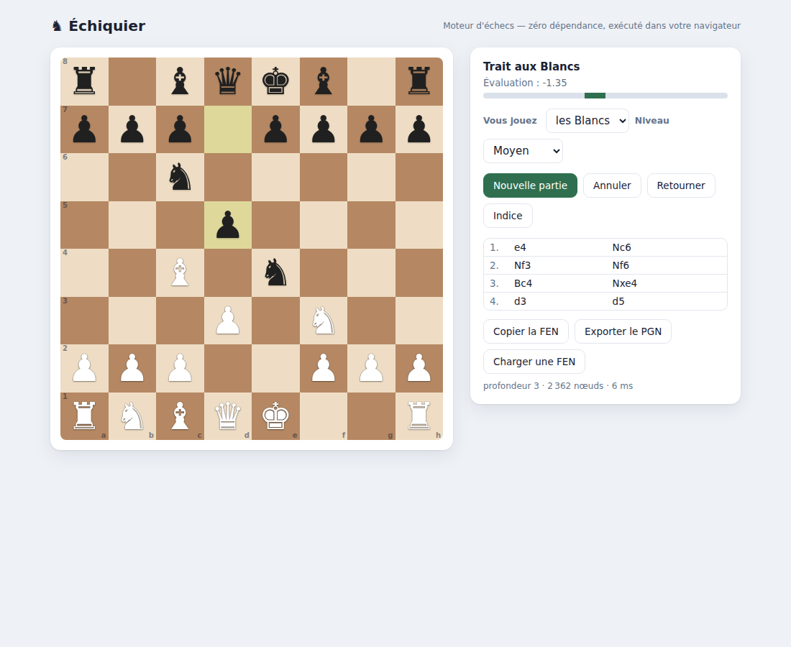

# Échiquier

Un **moteur d'échecs complet** écrit à partir de zéro, et une interface web pour
jouer contre lui dans votre navigateur. Génération de coups légale et **exacte**
(validée contre les valeurs *perft* de référence), recherche alpha-bêta avec
table de transposition, notation SAN, détection de toutes les fins de partie.

Comme le reste du dépôt, **aucune dépendance** : tout repose sur la seule
bibliothèque standard de JavaScript. Le moteur tourne aussi bien sous Node
(tests, perft) que dans le navigateur (via un Web Worker) — le même code, testé
d'un côté, joué de l'autre.



## Pourquoi c'est difficile (et pourquoi on peut le prouver)

La génération des coups d'échecs est un nid à bugs : roque (avec toutes ses
conditions), prise en passant (y compris les échecs à la découverte qu'elle
provoque), clouages absolus, sous-promotions… Une seule erreur et le moteur
« triche » subtilement.

La parade est le **perft** : le nombre exact de positions atteignables à une
profondeur donnée, depuis des positions de référence, est publié et connu. Si
notre générateur reproduit ces nombres au nœud près, il est correct. Échiquier
passe **toutes** les positions de référence, y compris jusqu'à ~4,8 millions de
nœuds :

```
position de départ  perft(5) = 4 865 609   ✓
Kiwipete            perft(4) = 4 085 603   ✓
position 3          perft(5) =   674 624   ✓
positions 4, 5, 6   ✓
```

(≈ 6 millions de nœuds par seconde en génération pure.)

## Fonctionnalités

**Moteur**
- Représentation **0x88**, chargement/écriture **FEN**, `make`/`unmake` avec pile
  d'annulation.
- Génération **légale** exacte : roque, prise en passant, promotions, clouages.
- **Hachage de Zobrist** incrémental (vérifié contre le recalcul complet).
- Recherche **négamax alpha-bêta** : approfondissement itératif, **recherche de
  quiescence** (captures), **table de transposition**, ordonnancement des coups
  (coup de hachage, MVV-LVA, tueurs, historique), gestion du temps.
- Évaluation : matériel + tables pièce-case + paire de fous, avec table de roi
  spécifique à la finale.
- **Notation SAN** complète (désambiguïsation, `+`/`#`, roque, promotion) et
  lecture SAN/UCI.
- Détection des fins : **mat, pat, matériel insuffisant, règle des 50 coups,
  répétition triple**. Export **PGN**.

**Interface**
- Échiquier interactif : coups légaux surlignés, dernier coup et échec mis en
  évidence, sélecteur de promotion.
- Jouez les Blancs ou les Noirs, **cinq niveaux** (profondeur/temps de réflexion).
- Barre d'**évaluation** et informations de recherche (profondeur, nœuds, temps).
- Liste des coups en SAN, **annuler**, **retourner** le plateau, **indice**,
  copier la **FEN**, charger une position, exporter le **PGN**.
- Le moteur s'exécute dans un **Web Worker** : l'interface ne se fige jamais.

## Prise en main

Node.js **≥ 22** requis.

```bash
npm start          # ouvre http://127.0.0.1:3224
npm test           # suite complète (perft, Zobrist, SAN, fins de partie, recherche)
npm run perft      # mesure de vitesse (perft profondeur 5)
```

### Configuration

| Variable | Défaut        | Rôle                |
|----------|---------------|---------------------|
| `PORT`   | `3224`        | Port d'écoute       |
| `HOST`   | `127.0.0.1`   | Interface d'écoute  |

Le serveur ne fait que servir des fichiers statiques (l'interface et les modules
du moteur) : **aucun calcul côté serveur**, tout se passe dans le navigateur.

## Architecture

```
server.js            Serveur statique (public/ à la racine, src/ sous /src)
src/
  board.js           Plateau 0x88, FEN, détection d'attaque, position des rois
  moves.js           Encodage des coups + make/unmake + Zobrist incrémental
  movegen.js         Génération pseudo-légale puis filtrage de légalité
  perft.js           Dénombrement perft (+ « divide » pour le débogage)
  zobrist.js         Clés de hachage (splitmix64) et recalcul de contrôle
  eval.js            Évaluation statique (matériel + tables pièce-case)
  search.js          Négamax alpha-bêta, quiescence, table de transposition
  san.js             Notation algébrique standard (écriture et lecture)
  game.js            État de partie, fins de partie, export PGN
public/
  index.html, style.css
  app.js             Interface (rendu, interaction, dialogue avec le worker)
  engine-worker.js   Web Worker exécutant la recherche
test/                Tests node:test (perft, zobrist, san, game, search)
```

## Notes

- **Force de jeu** : le moteur joue un niveau de club amateur correct — il ne
  fait pas de gaffe tactique élémentaire, calcule des mats forcés et respecte le
  matériel. Il n'ambitionne pas de rivaliser avec les moteurs professionnels
  (pas de tables de finale, d'évaluation NNUE, ni de multithreading).
- **Portabilité** : les modules `src/` sont du JavaScript standard, importés à
  l'identique par Node (pour les tests) et par le navigateur (pour le jeu).

## Licence

MIT.
