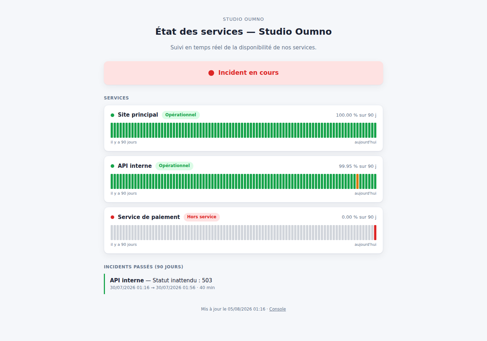
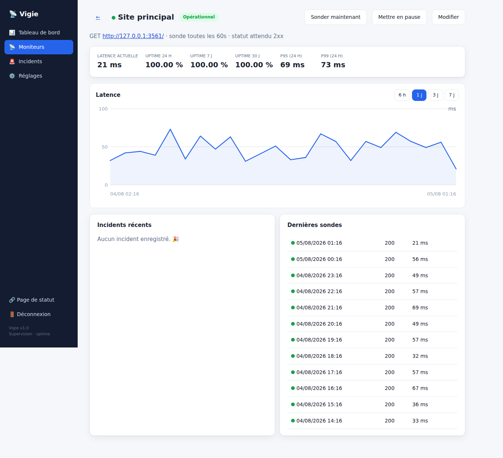

# Vigie

**Surveillance de disponibilité et page de statut**, auto-hébergées — une
alternative à UptimeRobot + Statuspage réunie en un seul service. Vigie sonde
vos services à intervalle régulier, mesure leur latence, détecte et historise
les incidents, calcule votre taux de disponibilité, et publie une **page de
statut** claire pour vos utilisateurs.

Comme les autres utilitaires de ce dépôt, Vigie n'a **aucune dépendance** : le
serveur HTTP, la base SQLite, l'ordonnanceur de sondes, l'agrégation de séries
temporelles et les graphiques SVG sont écrits sur la seule bibliothèque
standard de Node.js.



## Le problème résolu

Savoir — avant ses clients — qu'un service est tombé, disposer d'un historique
de disponibilité fiable, et communiquer l'état du système sans décrocher le
téléphone : c'est le rôle d'une page de statut. Les offres SaaS facturent cela
au mois et hébergent vos données de supervision. Vigie fait le même travail en
tournant **chez vous**.

## Fonctionnalités

**Supervision**
- Sondes **HTTP/HTTPS** à intervalle configurable, avec **timeout**, suivi de
  redirections, **statut attendu** (`200`, `2xx`, `2xx,3xx`…), **mot-clé requis
  ou interdit** dans le corps de la réponse.
- Seuil de **latence dégradée** (le service répond mais lentement).
- **Incidents** ouverts après N échecs consécutifs, **datés du vrai début de la
  panne**, résolus automatiquement au rétablissement.
- **Ordonnanceur** en tâche de fond, non bloquant, sans chevauchement, qui
  reprend naturellement au redémarrage (l'état est en base).

**Mesure & historique**
- Taux de **disponibilité** sur 24 h / 7 j / 30 j / 90 j.
- **Percentiles de latence** (p50, p95, p99), moyenne, min/max.
- **Rollups journaliers** et purge automatique des sondes brutes (rétention
  configurable) : l'historique 90 jours reste léger.

**Restitution**
- **Page de statut publique** : bannière d'état global, barres d'uptime 90
  jours par service (SVG), incidents en cours et passés. Rafraîchissement auto.
- **Console d'administration** : tableau de bord, détail d'un moniteur avec
  **graphique de latence** (SVG), incidents, dernières sondes, « sonder
  maintenant », mise en pause.

**Cœur technique**
- Sonde robuste (redirections bornées, lecture partielle du corps, erreurs
  réseau traduites en français).
- Agrégation exacte : incident daté du premier échec, `down_seconds` calculé
  par intersection des incidents avec chaque jour.
- Graphiques **SVG générés à la main**, autonomes, sans police ni script externe.



## Prise en main

Node.js **≥ 22.5** requis (module natif `node:sqlite`).

```bash
# Données de démonstration (admin : demo1234) avec 90 jours d'historique
npm run demo
# Page de statut : http://127.0.0.1:3223/
# Console admin : http://127.0.0.1:3223/#/admin

# Instance vierge (accès créé à la première connexion admin)
npm start

# Tests
npm test
```

### Configuration

| Variable      | Défaut              | Rôle                    |
|---------------|---------------------|-------------------------|
| `VIGIE_DATA`  | `./data/vigie.db`   | Fichier SQLite          |
| `PORT`        | `3223`              | Port d'écoute           |
| `HOST`        | `127.0.0.1`         | Interface d'écoute      |

Par défaut le service écoute en local. La page de statut est prévue pour être
exposée : placez Vigie derrière un reverse proxy TLS et fixez `HOST=0.0.0.0`.

## Architecture

```
server.js            Serveur HTTP (surfaces publique + admin) ; démarre l'ordonnanceur
src/
  probe.js           Sonde HTTP/HTTPS : timeout, redirections, assertions statut/mot-clé
  scheduler.js       Ordonnanceur en tâche de fond (intervalle par monitor, concurrence)
  monitor.js         Enregistrement des sondes + machine à états des incidents
  stats.js           Uptime, percentiles, rollups journaliers, historique 90 j, entretien
  charts.js          Graphiques SVG (barres d'uptime, courbe de latence)
  db.js              Schéma SQLite + migrations, réglages
  auth.js, router.js Authentification (scrypt, sessions) et micro-routeur HTTP
  api.js             API REST (admin + page de statut publique)
public/              SPA : page de statut (status-page.js) + console (admin.js)
test/                Tests node:test (probe, stats/incidents, charts, API)
```

## Notes d'exploitation

- **Requêtes sortantes** : Vigie contacte les URL supervisées en direct. Derrière
  un proxy sortant filtrant, autorisez les hôtes à superviser (les modules natifs
  http/https n'utilisent pas automatiquement `HTTP(S)_PROXY`).
- **Notifications** : Vigie détecte et historise les incidents ; l'envoi
  d'alertes (e-mail, webhook, Slack…) n'est pas embarqué et constitue une
  extension naturelle — l'ordonnanceur expose déjà un callback `onEvent`
  déclenché à l'ouverture et à la résolution des incidents.
- **Fiabilité des mesures** : les statistiques reflètent la fréquence de sonde.
  Un intervalle plus court donne une détection plus rapide et un uptime plus
  précis, au prix de plus de trafic.
- **Sécurité** : mot de passe scrypt, sessions hachées, cookie `HttpOnly` +
  `SameSite=Strict`, en-tête anti-CSRF sur les mutations, limitation anti
  force-brute. La page de statut est en lecture seule et n'expose que les
  moniteurs marqués publics.

## Licence

MIT.
